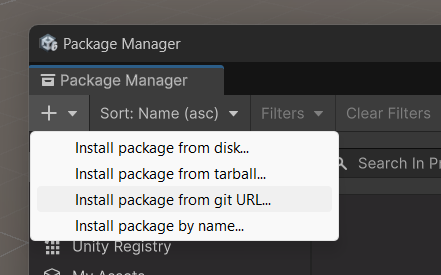
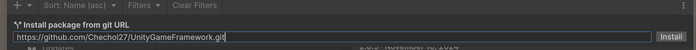

# UnityGameFramework
MVVM implementation of an unreal-aligned gameplay framework


## Development Setup

1. Create an empty unity 6000.3 project
2. Clone this repository into the `Assets` folder

```shell
cd X:/path/to/your/empty/unity/project/Assets
```

```shell
git clone https://github.com/Chechol27/UnityGameFramework.git
```

## Production setup

1. In your production project go to `Window/Package Manager`
2. Open the dropdown with the visile "+" button amd hit `install package from git`


3. Put this repository's link in the prompt and hit `install`

