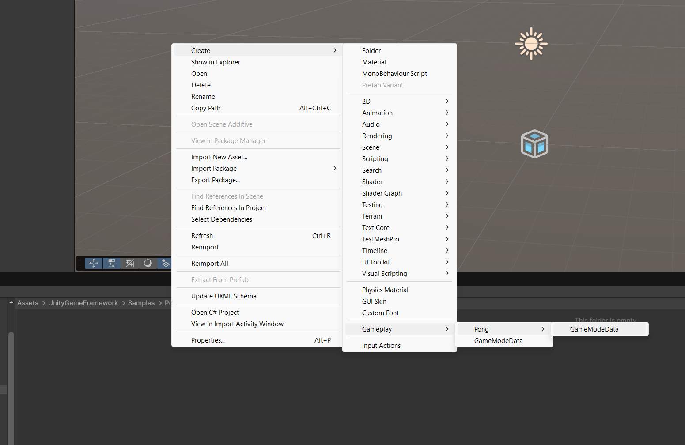

# Game Mode

First of all we'll start with the necessary default data our game is going to need:

A game mode is, essentially, a scriptable object, to create just create a new script that inherits from GameMode

```csharp
using UnityGameFramework.Game.State;
using UnityGameFramework.Game.State.Core;

public class PongGameMode : GameMode {

}
```

this is the barebones of a game mode, but remember, this is a `ScriptableObject` so we need to add a way to create the assets
we'll do this by using the `CreateAssetMenu` Attribute
```csharp
using UnityGameFramework.Game.State;
using UnityGameFramework.Game.State.Core;

[CreateAssetMenu(menuName="Gameplay/Pong/GameModeData")]
public class PongGameMode : GameMode {
    
}
```

By inheriting from `GameMode` we're already defining a set of default assets that will be constructed on match initialization

Now let's add the extra bits specific to our _**Pong**_ match rules:

- win score of 8
- Time limit of 5 minutes (in seconds to better work with Unity's `Time.deltaTime`)

additionally, since this is a local 2 player vs, let's make it so both players can play on the same keyboard, for that
we'll make an array of strings that represent which input mappings are used for which player based on their index

```csharp
using UnityGameFramework.Game.State;
using UnityGameFramework.Game.State.Core;

[CreateAssetMenu(menuName="Gameplay/Pong/GameModeData")]
public class PongGameMode : GameMode {
    public int winScore = 8;
    public float timeLimitSeconds = 300;
    public string[] localPerPlayerInputMappings;

}
```

now that our Pong-specific `GameMode` class is ready, let's create an asset



Now with the game mode in place you'll notice there are 2 unfilled fields: **Default Pawn Prefab** and **Player Controller**,
these 2 are supossed to be prefabs, but we'll cover them in [this](./PlayerAndPawn.md) chapter

## Next up... [Game States](./GameState.md)