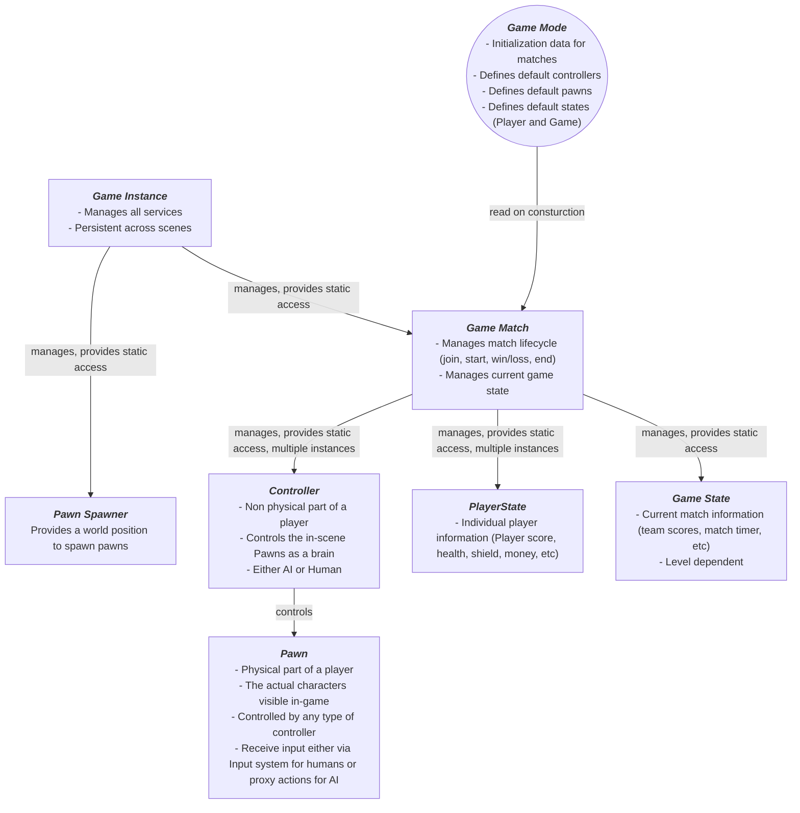

# Unity Game Framework

Unity is a very powerful and user-friendly game engine that allows for great projects to be made. its user friendliness
is in part thanks to how "barebones" the engine is shipped in regards to a framework.

This project is one of many that tries to standardize a way to manage Game states, matches, players and controllers; a
battle tested, well known architectural approach present in other engines such as Unreal or in house proprietary engines.

here's an overview of de different systems currently at play and how they interact with each other as well as a simple guide
to extend and use this framework in your games

