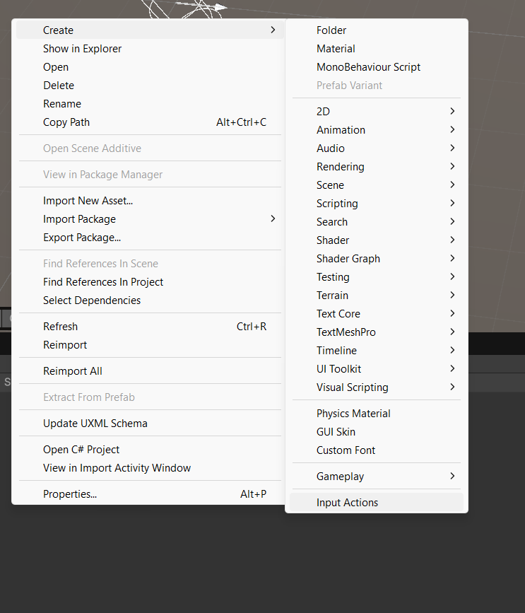
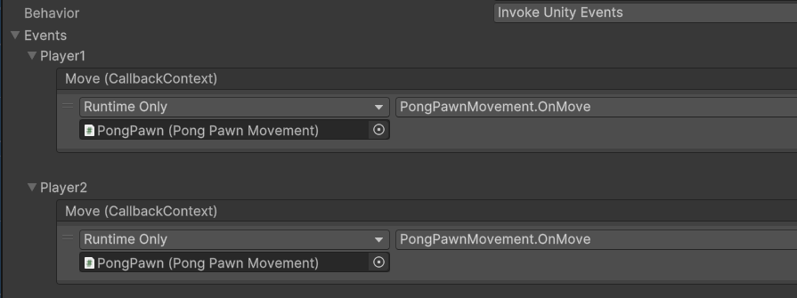

# Pawn Prefab

We have all the logic needed for our pawns to work, now we need to put it together nicely in a reusable bundle we all know and love: a prefab

For that we'll create an object with the following components:

- Box Collider
- Rigidbody
- PlayerInput
- PongPawn
- PongPawnMovement

now that we need to configure some of the components, I can't stress enough the fact that most of the built-in components
are designed to work in multiple environments with very diverse configurarions, the ones I'm going to make are just a permutation
of many others that are equally functional and valid or even better.

## Configuring the `Collider` component

For the ball to bounce perpetually, let's use a simple setup of physics materials, create a physics material asset and set
`Dynamic Friction` to 0, `Static Friction` to 0, and `Bounciness` to 1.

after that, just drag and drop the physics material to the `Collider`'s `Material` field

## Configuring the `Rigidbody` component

To avoid weird behaviors on our Pawns, let's setup the following fields:

- Is Kinematic: true
- Freeze Rotation: XYZ

## Configuring the `PlayerInput` component

The `PlayerInput` component is Unity's user interface to their _new_ input system, a more robust layer of abstraction
between mechanical inputs and our game-context-aware actions and function calls, for our inputs to work let's create a
new `InputActions` asset:

and this is how the actions and action mappings should look like:

now we just need to drag and drop our `InputActions` asset onto the `PlayerInput`'s `Actions` field

then we set the `Behavior` field as `Invoke Unity Events` and subscribe the `OnMove` method of the `PongPawnMovement` component
to the `Move` events in both the `Player1` and `Player2` action mappings:

now that we have an action mapping for each of our players, let's register their names into the game mode so the match knows
which action mapping to activate in which pawn it spawns

## Subscribing our pawn to the Game Mode

That's all we need to configure, now let's subscribe this pawn to the GameMode `ScriptableObject` in the `Default Pawn Prefab` field

## Next up... [Matches](./Match.md)

