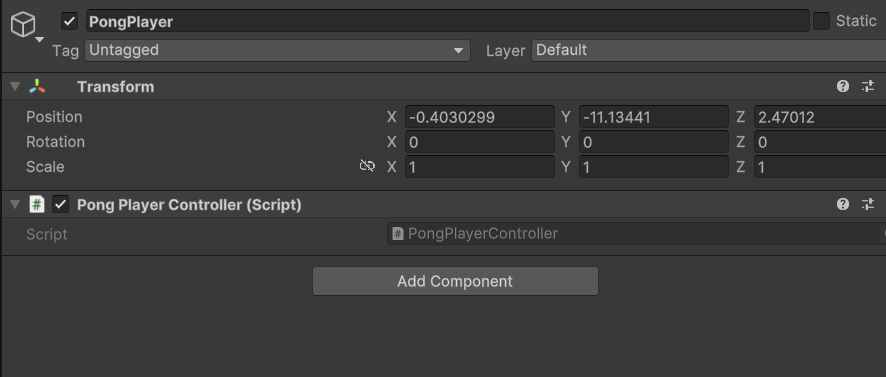
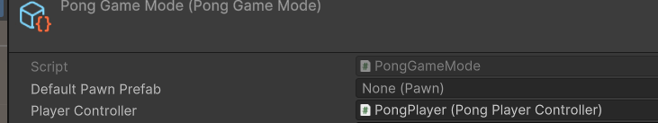

## Player and Pawn

Now we get to create our Player - Game interface by using `Players` and `Pawns`, these 2 types of objects are special
because their target delivery is a prefab, so let's start creating the code, then setting up our Prefab GameObject and
finally register them in our `GameMode`

### Player

This is an implementation of `Controller` that doesn't really need much in the context of _**Pong**_, just by creating a
child class of `Controller` should be enough

```csharp
public class PongPlayerController : Controller
{
    
}
```

then let's create an empty GameObject prefab that contains this script as a component



Now let's go to our `GameMode` `ScriptableObject` and register it under the `Player Controller` field



## Next up... [Pawn part 1: code](./PawnCode.md)


