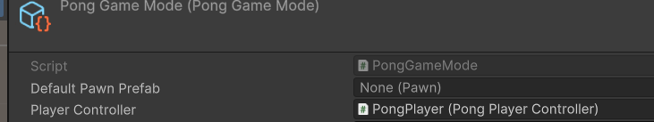

## Player and Pawn

Now we get to create our Player - Game interface by using `Players` and `Pawns`, these 2 types of objects are special
because their target delivery is a prefab, so let's start creating the code, then setting up our Prefab GameObject and
finally register them in our `GameMode`

### Player

This is an implementation of `Controller` that doesn't really need much in the context of _**Pong**_, just by creating a
child class of `Controller` should be enough

```csharp
public class PongPlayerController : Controller
{
    
}
```

then let's create an empty GameObject prefab that contains this script as a component


Now let's go to our `GameMode` `ScriptableObject` and register it under the `Player Controller` field



### Pawn

The pawn creation is a similar workflow, so, first let's create a child class of `Pawn`, these are going to be the actual
Objects the players are going to control in game, think of them as the characters of this game

```csharp
public class PongPawn : Pawn
{
}
```

thinking about how _**Pong**_ works, we'll need to implement a way to reset our `Pawn`'s position each time a goal is scored
for that let's do a bit of logic, fortunately, the `Pawn` parent class provides an overrideable method called `ResetState`
designed for a Respawn-like kind of situation

```csharp
public class PongPawn : Pawn
{
    private Vector3 startPosition;
    
    public override void ResetState()
    {
        transform.position = startPosition;
    }

    private void Awake()
    {
        startPosition = transform.position;
    }
}
```

also, since this is the actual controlled object, let's make a script for movement that works with the new Input system

```csharp
using UnityEngine.InputSystem;
using UnityGameFramework.Pawns.Core;

namespace UnityGameFramework.Samples.Pong
{
    [RequireComponent(typeof(Rigidbody))]
    public class PongPawnMovement : MonoBehaviour, IPawnComponent
    {
        [SerializeField] private float maxMotion = 5f;
        [SerializeField] private float motionVelocity = 5f;
        public Pawn ParentPawn { get; set; }
        
        private float currentPosition = 0;
        private float targetPosition;
        private float currentVelocity;

        private Rigidbody rigidbody;

        public void OnMove(InputAction.CallbackContext ctx)
        {
            if (!ctx.performed) return;

            Vector2 val = ctx.ReadValue<Vector2>();
            targetPosition = val.y > 0 ? 1 : 0;
        }

        private void Awake()
        {
            rigidbody = GetComponent<Rigidbody>();
        }

        private void Update()
        {
            currentPosition = Mathf.SmoothDamp(currentPosition, targetPosition, ref currentVelocity, 1/motionVelocity);
        }

        private void FixedUpdate()
        {
            rigidbody.position = Vector3.Lerp(((PongPawn)ParentPawn).SpawnPosition - transform.right * maxMotion, ((PongPawn)ParentPawn).SpawnPosition + transform.right * maxMotion, targetPosition);
        }
    }
}
```

Now let's get to the GameObject prefab of the pawn with the following components:

- Rigidbody
- PlayerInput
- PongPawn
- PongPawnMovement


