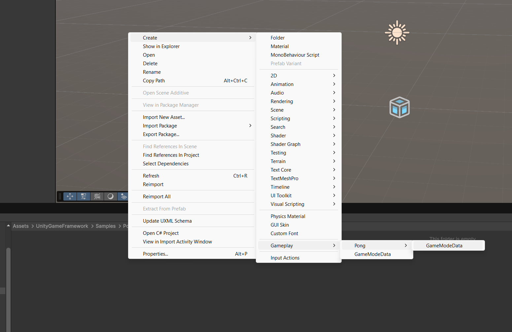

# Quickstart

Here are the steps to start using the framework, for this example, we're creating a _**Pong**_ game with the following (classic) rules

- 2 Player local competitive gameplay
- There's a time limit of 5 minutes, after this the match ends and a result is calculated based on player score
  - if player scores are different from each other, the player with higher score wins
  - if player scores are equal the match ends in a Tie
- The first player to achieve 8 points wins the match
- Players can only move in the vertical axis and confined to a min-max height

## Game Mode

First of all we'll start with the necessary default data our game is going to need:

A game mode is, essentially, a scriptable object, to create just create a new script that inherits from GameMode

```csharp
using UnityGameFramework.Game.State;
using UnityGameFramework.Game.State.Core;

public class PongGameMode : GameMode {

}
```

this is the barebones of a game mode, but remember, this is a `ScriptableObject` so we need to add a way to create the assets
we'll do this by using the `CreateAssetMenu` Attribute
```csharp
using UnityGameFramework.Game.State;
using UnityGameFramework.Game.State.Core;

[CreateAssetMenu(menuName="Gameplay/Pong/GameModeData")]
public class PongGameMode : GameMode {
    
}
```

By inheriting from `GameMode` we're already defining a set of default assets that will be constructed on match initialization

Now let's add the extra bits specific to our _**Pong**_ match rules:

- win score of 8
- Time limit of 5 minutes (in seconds to better work with Unity's `Time.deltaTime`)

```csharp
using UnityGameFramework.Game.State;
using UnityGameFramework.Game.State.Core;

[CreateAssetMenu(menuName="Gameplay/Pong/GameModeData")]
public class PongGameMode : GameMode {
    public int winScore = 8;
    public float timeLimitSeconds = 300;
}
```

now that our Pong-specific `GameMode` class is ready, let's create an asset



Now with the game mode in place you'll notice there are 2 unfilled fields: **Default Pawn Prefab** and **Player Controller**,
these 2 are supossed to be prefabs, but we'll cover them in [this](Player%20Prefabs) section


## Game State

Now that we have de initial default data, let's start with the mutable data that represents the current state of the game,
here we could save things that are conceptually general to the match but not necesarilly attributes of a Player's state,
in the case of pong we could save the following information:

- Current match time
- Player that scored a goal previously (to send the ball in that player's direction)

the game state is not a `ScriptableObject` but a `MonoBehaviour` script, this could be a simple native class but making it a component
allows us to check the state directly as an object in the scene. Let's create a script, inherit from `GameState` and add the previously defined fields

```csharp
using UnityGameFramework.Game.State.Core;

public class PongGameState : GameState
{
    public float currentMatchTimer;
    public int lastScoredPlayerId;
}
```

now we've got an object that will store the current match data.

## PlayerState

Now that we know what data will be updated on a match level, let's add the lower level: Player specific data

in this case we'll only need one single filed to store:

- Score

so let's create a script, inherit from `PlayerState` and add the field:

```csharp
using UnityGameFramework.Game.State.Core;

public class PongPlayerState : PlayerState
{
    public int score;
}
```

## Player and Pawn


## Match

This framework is designed to abstract the game into a series of matches and non-matches, let's define these 2 core terms and their constraints:

- Match: a scene or group of scenes that have a lifecycle and requires Players to control any kind of character (Pawn)
- Non-Match: a scene or group of scenes that provide simple functionality, like a main menu, an intermediate loading screen or any other instance in which there is no need for any character to be cotnroller

this means we can focus on the actual match gameplay "scene" that will define how our game behaves.

First let's join the game rules with the match system syntax/workflow and let's start from the lifecycle:

### A Match Lifecycle

Each match has a pre-defined collection of lifecycle methods that are not entirely automatically managed:
#### Managed
- PlayerJoin
  - Creates a controller object and its associated state
- PlayerSpawn
  - Spawns a pawn controlled by the designed controller
- PlayerRemove
  - Removes a pawn controlled by the designed controller
- PlayerLeave
  - Removes a controller from the match
- Initialize
  - This one is managed automatically, and it's called on Awake before all other objects in scene
  - Join all players retrieved from your own systems (like photon if making an online game)
#### Unmanaged
- Start
  - Starts the match (example: removing barriers in a tactical shooter or unlocking controls in a fighting game)
- Arbitrate
  - Checks if any of the conditions for the match to be ended are met (Example: checking if the red team has 200 points or testing whether the match timer is 0)
- End
  - Ends the match (Example: Removing controlled pawns and showing a scoreboard)
- Finalize
  - Finalizes the match (Example: Returning all players to a "lobby" scene)

Now let's create our own Match class specific to our needs:

create a script and inherit from `GameMatch`

```csharp
//Imported libraries...

public class PongMatch : GameMatch
{
}
```

now, a game match is too barebones because some matches maybe just a sandbox/spectate kind of "game", let's add game state and player state tracking capabilities
with the `IGameStateHandler<>` and `IPlayerStateHandler<>` interfaces and use our custom `GameState` and `PlayerState`
classes as a type parameter

```csharp
//Imported libraries...

public class PongMatch : GameMatch, IGameStateHandler<PongGameState>, IPlayerStateHandler<PongPlayerState>
{
    public PongGameState State { get; set; }
    public IGameStateHandler<PongGameState> AsGameStateHandler => this;
    public List<PongPlayerState> PlayerStates { get; }
    public IPlayerStateHandler<PongPlayerState> AsPlayerStateHandler => this;
}
```

now let's initialize our match by spawning our players

```csharp
// ... rest of class
    
protected override void InitializeMatch()
{
    PlayerJoin(GameMode.playerController);
    PlayerJoin(GameMode.playerController);
}
//...
```


now whenever the scene starts, the match initializes 2 players with their respective ids (0 and 1).

now we could introduce an extra lifecycle given the nature of Pong, each time a goal is scored we need to reset things like
the ball and pawn positions, let's make a custom event only specific to Pong

```csharp
public UnityEvent OnGoalScored;
```

when spawning our pawns, we can observe their `ResetState` behavior with this event

```csharp
public override Pawn SpawnPlayer(int playerId, Pawn pawnPrefab = null, bool ditchPreviousControlledPawn = true)
{
    Pawn ret = base.SpawnPlayer(playerId, pawnPrefab, ditchPreviousControlledPawn);
    if(ret != null)
        OnGoalScored.AddListener(ret.ResetState);
    return ret;
}
```

Now let's start our match by spawning a pawn for each player, this will automatically enable our pawn inputs

```csharp
// ... rest of class
protected override void StartMatch()
{
    SpawnPlayer(0, GameMode.defaultPawnPrefab);
    SpawnPlayer(1, GameMode.defaultPawnPrefab);
}
//...
```

after the match has been initialized, there is only one thing to do for 


